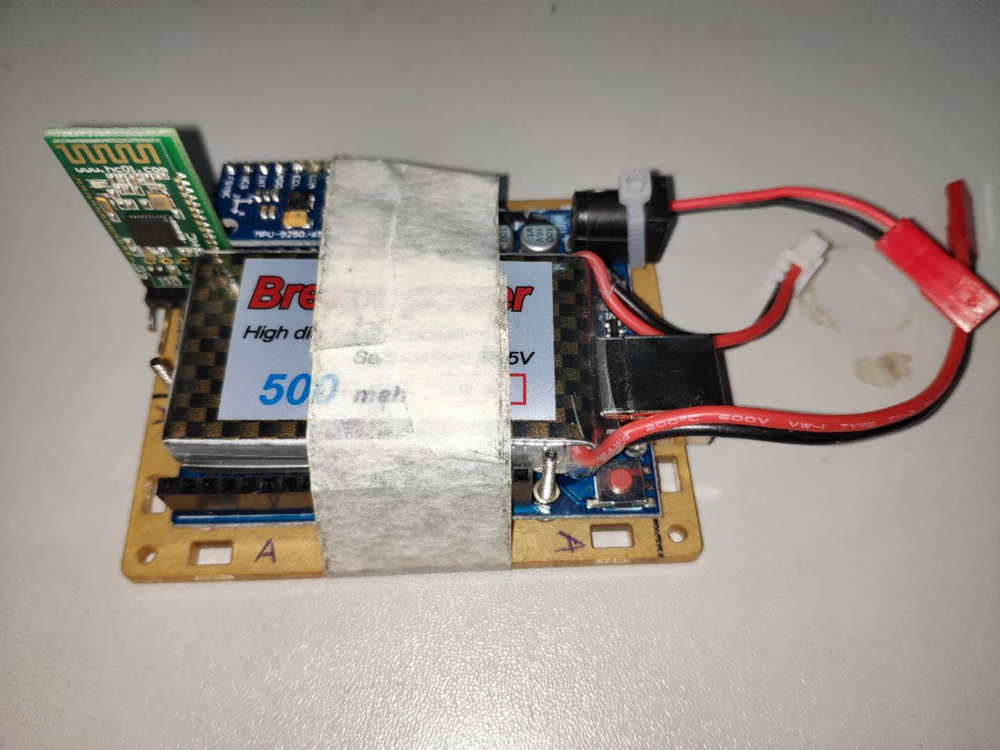
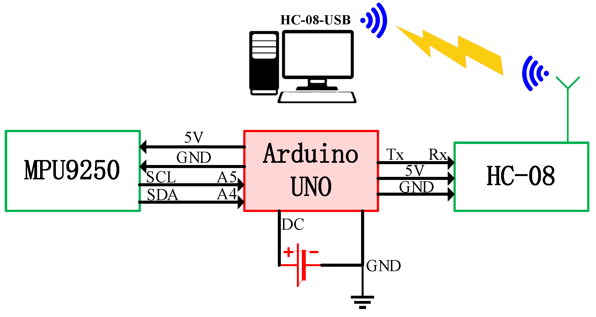
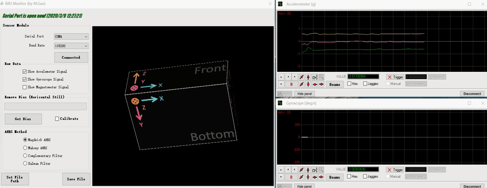

# MPU9250-AHRS-Arduino

项目文件说明：

- **[01]_Arduino_Code_MPU9250**: Arduino的源程序
- **[02]\_C\_#_IMU_Exe**：上位机软件
- **[03]\_C#\_IMU_Project**：上位机软件源程序
- **[04]_madgwick_algorithm_matlab**：AHRS的MATLAB源程序
- **[05]_PDF**：一份PDF说明文档
- **images**：配图

------

## 项目简介：

利用MPU9250和Aruduino UNO搭建一个简易的AHRS硬件平台，如下图所示，

  
  
   
  <em>Fig. 1: 简易AHRS硬件系统，可利用蓝牙与上位机通信</em>

### 硬件功能

1. Arduino通过I2C读取MPU9250模块9轴数据；
2. 对数据添加校验位并进行编码，之后通过串口发送；
3. 采用一块7.4V锂电池通过DC接口(7~12V)进行供电；

### 连接示意图

  
   
  <em>Fig. 2:Arduino与MPU9250连接示意图1</em>

  
   
  <em>Fig. 2:Arduino与MPU9250连接示意图2</em>

### 上位机功能

1. 接收硬件数据，解码后得到正确的传感器数据；
2. 进行AHRS解算，得到姿态角；
3. 姿态角的实时三维显示；

  
   
  <em>Fig. 3:上位机运行界面</em>

### 相关驱动：

HC08蓝牙驱动，Arduino模块驱动，

建议上网搜，或者用驱动精灵解决

### 参考资料

[MPU-9250 Accelerometer, Gyroscope and Magnetometer Code](http://robojax.com/learn/arduino/?vid=robojax-MPU9250)
